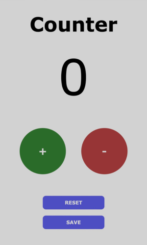

<h1 align="center"> LexFortis </h1>

Este site é um app para contagem.

  <a href="#-tecnologias">Tecnologias</a>&nbsp;&nbsp;&nbsp;|&nbsp;&nbsp;&nbsp;
  <a href="#-projeto">Projeto</a>&nbsp;&nbsp;&nbsp;

 

  

## 🧠 Tecnologias

Esse projeto foi desenvolvido com as seguintes tecnologias:

- JavaScript
- HTML
- CSS
- Git e Github
- Figma

## 💻 Projeto

O Counter é app para fazer contagens de números, e salva-los quantas vezes quiser!

- [Acesse o projeto finalizado, online](https://appcontagem.netlify.app)

- [Acesse o projeto finalizado, no github](https://zugouveia.github.io/counter/)

---

 

   Feito por Zu Gouveia 🖤

